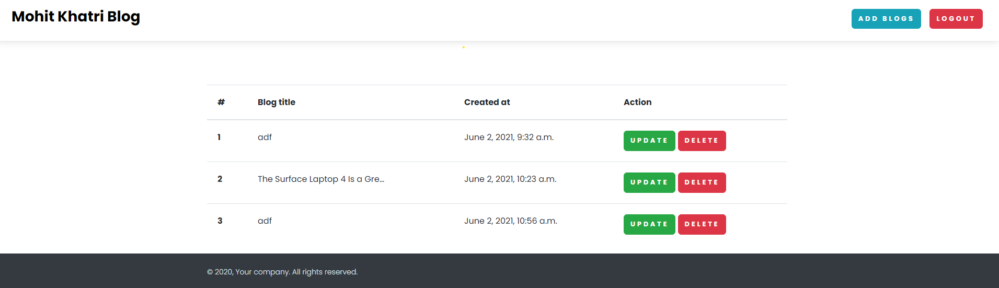

# blog - application dynamic add pages and multiple users
## 
Note: I create this project while i started learning djagno and DRF just for demo purposes.
By creating this i want to explore how to know how things works on scalable applications.
Learnings from this project:
1. How to do authentication using api and create profile.
2. how to do CRUD operations, dynamic urls create, profile, send email, scalable project, roles, multiple users, account verification, celery, token and many more etc.

3. commands practice etc
--> *Preview :*

  
  
  
  
  
  

steps:
1. you can directly run project using commnads.
2. Note: you may not need all requirements library just need djang, request, python, sqlite etc
3. if you want to acces the admin pannel.
4. user: admin
5. password: admin
6. Then refresh the page of blogs.

Note Problems:
As the project is created for only training and testing features purposes.
So it contains lots of bugs.
1. UI bugs.
2. Profile filed checking bugs.
3. User register has little problems.
etc. 

